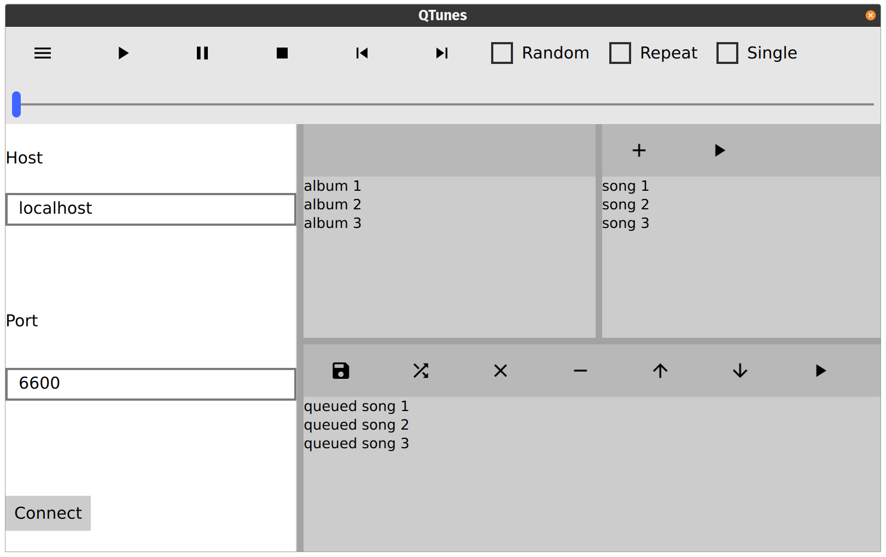

# QTunes

This is going to be a QML MPD client. Watch this space.

It will use FontAwesome icons. Please see their [license](https://fontawesome.com/license).

Here are some screenshots of what it looks like so far:

